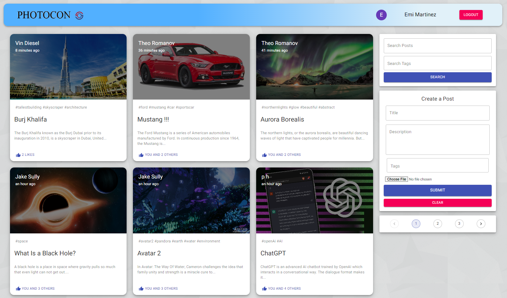
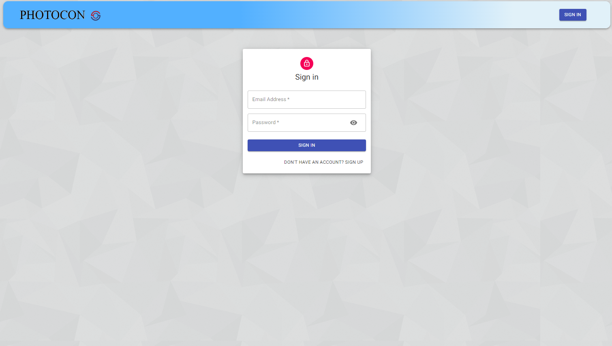
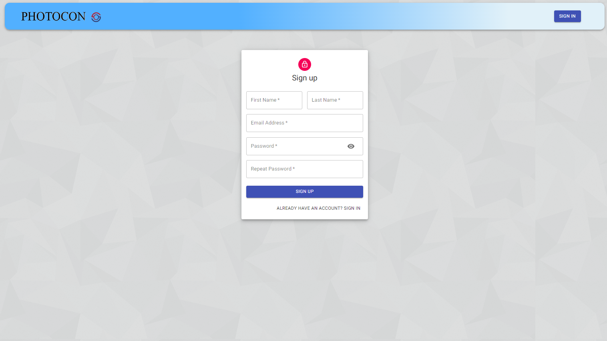

# PhotoconApp

<li>
Developed a platform for users to share ideas, views and thoughts. 
</li>
<li>
Includes CRUD operations for users with Authentication using JWT. 
</li>
<li>
Users can Search and Filter posts, Like, Comment and add Tags to post. 
</li>
<li>
Facilitated Pagination, Recommended Posts and Post Details Page. 
</li>
 
<b>Tech Stack:<b>
MERN
 
 

Hosted on: 
Frontend=> Netlify 
BackEnd=> Cyclic

<b>Images: <b>
 
<table style="border:1px solid;">
  <tr >
    <th style="text-align: center; border:1px solid;">Home Page</th>
  </tr>
  <tr >
    <td style="text-align: center; border:1px solid;padding:1em;">
        
    </td>
  </tr>
</table>
   
<table style="border:1px solid;">
  <tr >
    <th style="text-align: center; border:1px solid;">Login Page</th>
  </tr>
  <tr >
    <td style="text-align: center; border:1px solid;padding:1em;">
        
    </td>
  </tr>
</table>
   
<table style="border:1px solid;">
  <tr >
    <th style="text-align: center; border:1px solid;">SignUp Page</th>
  </tr>
  <tr >
    <td style="text-align: center; border:1px solid;padding:1em;">
         
    </td>
  </tr>
</table>
